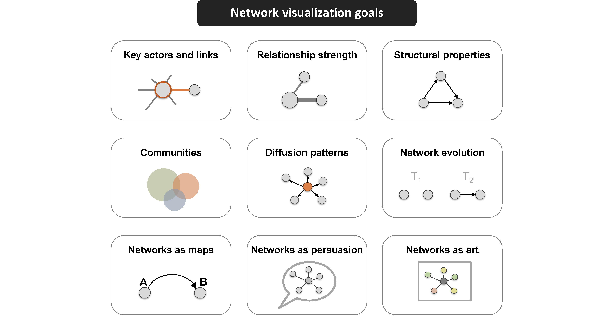
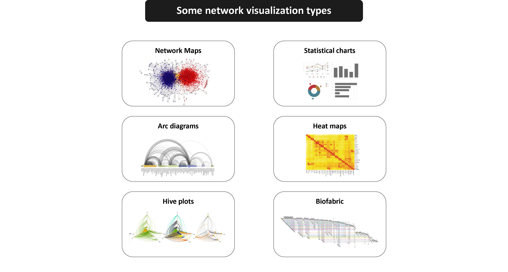
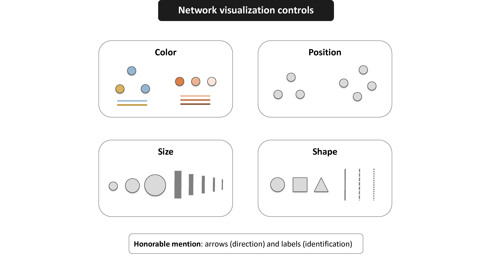

```{r setup, include=FALSE}
knitr::opts_chunk$set(echo = TRUE, message=FALSE, warning=FALSE)
```

## 静态和动态网络可视化与R
这是一个关于网络可视化的综合教程。它涵盖了数据输入和格式、可视化基础、参数和单模图和二部图的布局;处理纵向网络的多链路、交互式和动画可视化;在地理地图上可视化网络。

### 1 简介:网络图可视化（不是web v）
设计网络可视化的主要关注点是它必须服务的目的。

我们想要强调的结构特性是什么?

我们想要解决的关键问题是什么?

{fig.align='center'}

网络图远不是图形可用的唯一可视化

其他网络表示格式，甚至是关键特征的简单图表，在某些情况下可能更合适。

{fig.align='center'}

在网络地图中，与其他可视化格式一样，我们有几个控制结果的关键元素。
主要有-颜色、-大小、-形状和-位置。

{fig.align='center'}

现代图形布局优化了结构和美学。特别地，它们寻求最小化重叠和边交叉，并确保图中的边长度相似。

{fig.align='center'}

#### 需要使用的包
```{r}
## 关键的
# install.packages("igraph")
# install.packages("network")
# install.packages("sna")
# install.packages("visNetwork")
# install.packages("threejs")
# install.packages("ndtv")
## 可选的
# install.packages("png")
# install.packages("ggraph")
# install.packages("networkD3")
# install.packages("animation")
# install.packages("maps")
# install.packages("geosphere")
```

### 2 R图中的颜色
这里有多样化的代码可以改变颜色。

```{r}
# 设置背景颜色
par(bg="slateblue2")
# 这行代码绘制了x坐标为1到10,y坐标为6的一组点,点的类型是pch=13(空心×点),大小为cex=7,颜色为dark red。
plot(x=1:10, y=rep(6,10), pch=1, cex=7, col="dark red")
# 这行代码在同一个图上额外绘制了一组点
points(x=1:10, y=rep(5, 10), pch=22, cex=3, col="557799")
# 定义点的颜色为RGB(0.25, 0.5, 0.3),且透明度为0.5。xlim=c(0,6)
# 设置x轴的范围是从0到10。
points(x=1:7, y=rep(7,7), pch=19, cex=12, col=rgb(.25, .5, .3, alpha=.5), xlim=c(0,10)) 
# 获取颜色并半透明
col.tr <- grDevices::adjustcolor("skyblue4", alpha=0.7)
points(x=1:7, y=rep(8,7), pch=19, cex=12, col=col.tr)
# 显示所有蓝色颜色
grep("blue", colors(), value=T) 
```
R提供了一些预定义的调色板函数，可以为我们生成这些调色板。
```{r}
pal1 <- heat.colors(5, alpha=1)   #  5 colors from the heat palette, opaque
pal2 <- rainbow(5, alpha=.5)      #  5 colors from the heat palette, transparent
plot(x=1:10, y=1:10, pch=19, cex=5, col=pal1)
points(x=3:12, y=1:10, pch=19, cex=5, col=pal2)
# 自己生成渐变调色板
pal3 <- colorRampPalette(c("steelblue", "dark red")) 
points(x=10:1, y=1:10, pch=19, cex=5, col=pal3(10)) 
# 加上透明度
pal4 <- colorRampPalette(c(rgb(1,1,1, .2),rgb(.8,0,0, .7)), alpha=TRUE)
points(x=12:3, y=1:10, pch=19, cex=13, col=pal4(10))

```

### 3 数据的格式、大小和准备
在本教程中，我们将主要使用两个小的示例数据集。

两者都包含有关媒体组织的数据。

- 其中一个涉及到新闻来源之间的超链接和提及网络。

- 第二个是媒体场所和消费者之间的联系网络。

虽然这里使用的示例数据很小，但我们将生成的可视化背后的许多思想适用于中型和大型网络。这也是为什么我们很少使用某些视觉属性(如节点符号的形状)的原因:这些在较大的图形地图中是不可能区分的。事实上，当绘制非常大的网络时，我们甚至可能想要隐藏网络边缘，并专注于识别和可视化节点社区。

#### 3.1 数据集1:edgelist
我们要处理的第一个数据集由两个文件组成，`Dataset1-Media-Example-NODES.csv`和`Dataset1-Media-Example-EDGES.csv`

```{r}
nodes <- read.csv("Dataset1-Media-Example-NODES.csv", header=T, as.is=T)
links <- read.csv("Dataset1-Media-Example-EDGES.csv", header=T, as.is=T)
head(nodes)
head(links)
```

#### 3.2 用`igraph`创建一个对象
接下来，我们将原始数据转换为`igraph`对象。为此，我们将使用`graph_from_data_frame()`函数，该函数接受两个数据帧:`d`和`vertices`。
- d是网络的边
- vertices 是节点的属性

```{r}
library(igraph)
net <- graph_from_data_frame(d=links, vertices=nodes, directed=T) 
net
```

> - D或U，对于有向图或无向图
- N表示命名图(其中节点有一个name属性)
- W表示加权图(其中边具有权重属性)
- B表示二部(双模式)图(其中节点具有类型属性)

现在我们有了我们的igraph网络对象，让我们尝试多次绘制它。

```{r}
par(mfrow=c(1,3), mar=c(0,0,0,0)) 
plot(net) # 不够完美仍需改进
# 看起来不太好。让我们通过移除图中的循环来解决问题。让我们第二次尝试绘制它。
net2 <- simplify(net, remove.multiple = F, remove.loops = T) 
plot(net2) # 不够完美仍需改进
# 第三次
net2 <- simplify(net, remove.multiple = T, remove.loops = T) 
plot(net2, edge.arrow.size=.4,vertex.label=NA) # 不够完美仍需改进

```


```{r}

```

#### 3.3 数据集2:matrix
第二个数据集是新闻媒体和消费者之间的链接网络。它包括两个文件，`Dataset2-Media-Example-NODES.csv`和`Dataset2-Media-Example-EDGES.csv`

```{r}
nodes2 <- read.csv("Dataset2-Media-User-Example-NODES.csv", header=T, as.is=T)
links2 <- read.csv("Dataset2-Media-User-Example-EDGES.csv", header=T, row.names=1)
#head(nodes2)
#head(links2)
```

#### 3.4 图中的二模(二部)网络
```{r}
links2 <- as.matrix(links2)
net3 <- graph_from_incidence_matrix(links2)
plot(net3)
table(V(net3)$type)
```
使用`graph_from_adjacency_matrix()`将单模网络矩阵转换为一个`igraph`对象。

> 我们来复习一下命令
> -
- `utils::read.csv()`#读取csv格式的数据
- `utils::head()`#预览数据
- `graphics::plot()`#画图
- `igraph::graph_from_data_frame()`#接受边数据和点数据并转换
- `igraph::simplify()`#精简结构
- `igraph::graph_from_incidence_matrix()`#从关联矩阵创建一个二部图对象
- `igraph::graph_from_adjacency_matrix()`#是一个灵活的函数，用于从邻接矩阵创建图对象
- `igraph::V()`#创建一个顶点序列(vs)，包含一个图的所有顶点。
- `base::table()`#统计
- `base::as.matrix()`#数据集格式转换
- `base::dim()`#检索或设置对象的维度。

### 4 用`igraph`绘制网络
#### 4.1 绘制参数
| 节点参数 | 备注 |
|-|-|
| vertex.color | 点的颜色 |
| vertex.frame.color | 点边缘的颜色 |
| vertex.shape	 |  从“none”, “circle”, “square”, “csquare”, “rectangle”, “crectangle”, “vrectangle”, “pie”, “raster”,  “sphere”中选 |
| vertex.size | 点的大小，默认15 |
| vertex.size2 | 对于矩形的第二维度大小 |
| vertex.label | 标记点的文字，不显示的值为NA |
| vertex.label.color | 文字的颜色 |
| vertex.label.family	 | 文字的字体”Times”, “Helvetica” |
| vertex.label.font	 | 字体格式1 plain, 2 bold, 3, italic, 4 bold italic, 5 symbol |
| vertex.label.cex | 字体大小 |
| vertex.label.dist | 文字与顶点的距离 |
| vertex.label.degree | 文字的相对位置标签相对于顶点的位置，其中0在右边，“pi”在左边，“pi/2”在下面，“-pi/2”在上面 |

| 边参数 | 备注 |
|-|-|
| edge.color | 边的颜色 |
| edge.width	 | 边的宽度，默认1 |
| edge.arrow.size | 箭头大小，默认1 |
| edge.arrow.width | 箭头宽度，默认1 |
| edge.lty | 线条类型0或blank(黑线)， 1或solid(实线)， 2或dashed(虚线), 3或dotted(点划线), 4或dotdash(点划线),  5或longdash(长划线), 6或twodash(双划线) |
| edge.label | 边的文字标记 |
| edge.label.family | 文字的字体 |
| edge.label.font | 字体格式 |
| edge.label.cex | 字体大小 |
| edge.curved | 边缘曲率，范围0-1 (FALSE设置为0,TRUE设置为0.5) |
| arrow.mode | 箭头的向量，0没有箭头，1向后，2向前，3两者都有 |

| 其他 | 备注 |
|-|-|
| margin | 图周围的空白边距，长度为4的向量 |
| frame | TRUE图就被框住 |
| main | 设置标题 |
| sub | 设置副标题 |
| asp | 图的比例 |
| palette | 节点的调色板 |
| rescale | 默认True |

我们可以用两种方式设置节点和边缘选项——第一种是在`plot()`函数中指定它们.
```{r}
plot(net, vertex.color = "blue", vertex.frame.color = "grey", vertex.shape = "circle", vertex.size = 15, vertex.label=V(net)$media, vertex.label.color = "black",  vertex.label.family = "Times", vertex.label.font = 3, vertex.label.cex = 1, vertex.label.dist = 1, edge.color="lightsteelblue", edge.width = 1, edge.arrow.size =1, edge.arrow.width = 1, edge.lty = 4, edge.curved = 1) 
```

设置属性的第二种方法是将它们添加到`igraph`对象中。假设我们想要根据媒体类型为网络节点上色，并根据度中心性为其大小(更多链接->更大节点)。我们还将根据它们的权重改变边缘的宽度。

```{r}
par(mfrow=c(1,2), mar=c(0,0,0,0)) 
# 根据媒体类型设置颜色:
colrs <- c("gray50", "tomato", "gold")
V(net)$color <- colrs[V(net)$media.type]

# 计算节点的线的数量，并用这个数量来规定节点大小:
deg <- degree(net, mode="all")
V(net)$size <- deg*3
# 也可以使用观众的数量:
V(net)$size <- V(net)$audience.size*0.6

# 默认标签是id，现在设置为没有标签:
#V(net)$label <- NA
V(net)$shape <- "circle"
V(net)$label <- NA #V(net)$media
V(net)$label.family <- "Helvetica"
V(net)$label.font <- 3
V(net)$label.cex <- 1
V(net)$label.dist <- 0

# 根据权重设置线条的宽度:
E(net)$width <- E(net)$weight/6

# 更改箭头大小和边缘颜色:
E(net)$arrow.size <- 0.2
E(net)$edge.color <- "gray80"
E(net)$edge.lty <- 1
E(net)$curved <- 0

# 更改络布局:
graph_attr(net, "layout") <- layout_with_lgl
plot(net) 

###########################右图##############################


#我们也可以在`plot()`覆盖这些属性让我们根据源节点的颜色给图的边上色。plot()覆盖模式
edge.start <- ends(net, es=E(net), names=F)[,1]
edge.col <- V(net)$color[edge.start]
# plot覆盖
plot(net, edge.color=edge.col, edge.curved=.1, layout = layout_with_fr)  

```

#### 4.2 网络布局
网络布局是简单的算法，返回网络中每个节点的坐标。
为了研究布局，我们将生成一个略大的100节点图。我们使用`sample_pa()`函数，它生成一个简单的图，从一个节点开始，并根据预设的优先连接级别(Barabasi-Albert模型)添加更多的节点和链接。

| 拓展 | 知识 |
|-|-|
| Barabási-Albert(BA)模型是网络科学中一个重要的网络生成模型,由Albert-László Barabási和Réka Albert在1999年提出。 | BA模型的主要特点是:网络按照新增节点的方式逐步生长。新节点与现有节点连接的概率与现有节点的度数成正比(优先连接原则),度数大的节点更有可能获得新的链接。 |
| BA模型成功解释了许多实际复杂网络(如互联网、科研合作网)中存在的无标度特性。它简单而又富有成效地揭示了复杂网络背后的一些基本演化机制。 | 通过这种机制,网络节点的度分布遵循幂律分布,呈现出无标度网络的拓扑特性。 |
| BA模型已成为网络科学中一个基础而重要的网络模型。  | 在R语言中,可以通过多个包来生成BA模型网络,如igraph、network等。主要是按照上述规则定义新增节点逐步连接的过程。 |
|-|-|

```{r}
net.bg <- sample_pa(100) 
V(net.bg)$size <- 8
V(net.bg)$frame.color <- "white"
V(net.bg)$color <- "orange"
V(net.bg)$label <- "" 
E(net.bg)$arrow.mode <- 0
plot(net.bg)
```
```{r}
par(mfrow=c(2,2), mar=c(0,0,0,0)) # plot four figures - 2 rows, 2 columns
# 自由布局
plot(net.bg, layout=layout_randomly)
# 圆形布局
l <- layout_in_circle(net.bg)
plot(net.bg, layout=l)
#线性布局
l <- cbind(1:vcount(net.bg), c(1, vcount(net.bg):2))
plot(net.bg, layout=l)

# 3d表面布局
plot(net.bg, layout=layout_on_sphere)
par(mfrow=c(1,2), mar=c(0,0,0,0)) 
# Fruchterman-Reingold 布局
## Fruchterman-Reingold是最常用的定向力布局算法之一。力导向布局试图得到一个好看的图形，其中边的长度相似，并且尽可能少地交叉。他们把图形模拟成一个物理系统。节点是带电粒子，当它们靠得太近时会相互排斥。这些边就像弹簧一样，把连接的节点吸引得更近。因此，节点均匀分布在整个图表区域，并且布局直观，共享更多连接的节点彼此更近。这些算法的缺点是它们相当慢，因此很少用于大于1000个顶点的图。
plot(net.bg, layout=layout_with_fr)
## 使用niter参数来控制要执行的迭代次数。默认设置为500次迭代。对于大型图表，您可以降低这个数字，以便更快地获得结果，并检查它们是否合理。Fruchterman-Reingold布局不是确定的——不同的运行将导致略有不同的配置。将布局保存在l中允许我们多次获得完全相同的结果
l <- layout_with_fr(net.bg, niter=50)
plot(net.bg, layout=l)
```

```{r}
par(mfrow=c(2,2), mar=c(1,1,1,1)) 
# 一些布局有3D版本，你可以使用参数dim=3。如您所料，3D布局返回一个包含3列的矩阵，其中包含每个节点的X、Y和Z坐标。
l <- layout_with_fr(net.bg, dim=3)
plot(net.bg, layout=l)
# 另一个流行的力导向算法Kamada Kawai对连通图产生了很好的结果。和Fruchterman Reingold一样，它试图最小化弹簧系统中的能量。
l <- layout_with_kk(net.bg)
plot(net.bg, layout=l)
# Graphopt是在igraph中实现的一个很好的强制定向布局，它使用分层来帮助实现大型网络的可视化。
l <- layout_with_graphopt(net.bg)
plot(net.bg, layout=l)
# 可用的照相参数可以用来改变节点的质量和电荷，以及边的最佳弹簧长度和弹簧常数。参数名称是charge(默认为0.001)、mass(默认为30)、spring。长度(默认为0)和弹簧。常数(默认为1)。调整这些可以导致相当不同的图形布局。
l <- layout_with_graphopt(net.bg, charge=0.02)
plot(net.bg, layout=l)

```

让我们来看看在igraph中所有可用的布局:
```{r}
layouts <- grep("^layout_", ls("package:igraph"), value=TRUE)[-1] 
# Remove layouts that do not apply to our graph.
layouts <- layouts[!grepl("bipartite|merge|norm|sugiyama|tree", layouts)]

par(mfrow=c(3,3), mar=c(1,1,1,1))
for (layout in layouts) {
  #print(layout)
  l <- do.call(layout, list(net)) 
  plot(net.bg, edge.arrow.mode=0, layout=l, main=layout) }
```

#### 4.3 突出网络的某个方面
我们的网络图仍然没有太大帮助。我们可以识别节点的类型和大小，但不能看到太多的结构，因为我们正在检查的链接是如此密集。解决这个问题的一种方法是，看看我们是否可以使网络稀疏化，只保留最重要的联系，丢弃其余的。

有更复杂的方法来提取关键边，但出于本练习的目的，我们只保留权重高于网络平均值的边。在`igraph`中，我们可以使用`delete_edges(net, edges)`来删除边:

```{r}
cut.off <- mean(links$weight) 
net.sp <- delete_edges(net2, E(net2)[weight<cut.off])
plot(net.sp, layout=layout_with_kk) 
```

我们还可以通过显示网络中的社区来使网络地图更有用:

```{r}
par(mfrow=c(1,2))

# 社区检测：一种在网络中识别紧密连接的节点组的方法，通常用于分析社交网络、生物网络等复杂网络结构。
clp <- cluster_optimal(net)
class(clp)

# 社区检测返回一个“communities”类的对象。
plot(clp, net, vertex.label=NA)
 
# 我们也可以绘制社区，而不依赖于它们的内置图:
V(net)$community <- clp$membership
colrs <- adjustcolor( c("gray50", "tomato", "gold", "yellowgreen"), alpha=.6)
plot(net, vertex.color=colrs[V(net)$community], vertex.label=NA)
```


#### 4.4 突出显示特定的节点或连线
有时我们希望将可视化集中在一个特定节点或一组节点上。在我们的示例媒体网络中，我们可以检查焦点参与者的信息传播。例如，让我们表示到纽约时报的距离。
`distances`函数返回从`v`参数中列出的节点到`to`参数中包含的节点的最短路径矩阵。
```{r}
par(mfrow=c(3,2), mar=c(0,0,0,0))

dist.from.NYT <- distances(net, v=V(net)[media=="NY Times"], 
                           to=V(net), weights=NA)

# 设置颜色来绘制距离:
oranges <- colorRampPalette(c("dark red", "gold"))
col <- oranges(max(dist.from.NYT)+1)
col <- col[dist.from.NYT+1]

plot(net, vertex.color=col, vertex.label=dist.from.NYT, edge.arrow.size=.6, 
     vertex.label.color="white")

#############################右图############################
# 我们还可以突出显示网络中的路径:
news.path <- shortest_paths(net, 
                            from = V(net)[media=="MSNBC"], 
                             to  = V(net)[media=="New York Post"],
                             output = "both") # both path nodes and edges

# Generate edge color variable to plot the path:
ecol <- rep("gray80", ecount(net))
ecol[unlist(news.path$epath)] <- "orange"
# Generate edge width variable to plot the path:
ew <- rep(2, ecount(net))
ew[unlist(news.path$epath)] <- 4
# Generate node color variable to plot the path:
vcol <- rep("gray40", vcount(net))
vcol[unlist(news.path$vpath)] <- "gold"

plot(net, vertex.color=vcol, edge.color=ecol, 
     edge.width=ew, edge.arrow.mode=0, vertex.label=NA)
#############################左图############################
# 我们可以突出显示进入或离开顶点的边，例如WSJ。对于单个节点，使用incident()，对于多个节点，使用incident_edges()
inc.edges <- incident(net,  V(net)[media=="Wall Street Journal"], mode="all")

# Set colors to plot the selected edges.
ecol <- rep("gray80", ecount(net))
ecol[inc.edges] <- "orange"
vcol <- rep("grey40", vcount(net))
vcol[V(net)$media=="Wall Street Journal"] <- "gold"
plot(net, vertex.color=vcol, edge.color=ecol)
#############################右图############################
# WSJ说，我们还可以指向顶点的近邻。邻居函数从焦点参与者一步找到所有节点。要查找多个节点的邻居，使用adjacent_vertices()而不是neighbors()。要找到向外走不止一步的节点邻域，可以使用函数ego()，参数顺序设置为从焦点节点向外走的步数。
neigh.nodes <- neighbors(net, V(net)[media=="Wall Street Journal"], mode="out")

# Set colors to plot the neighbors:
vcol[neigh.nodes] <- "#ff9d00"
plot(net, vertex.color=vcol)


#将注意力吸引到一组节点的一种方法是“标记”它们:
#############################左图############################
plot(net, mark.groups=c(1,4,5,8), mark.col="#C5E5E7", mark.border=NA)
#############################右图############################
plot(net, mark.groups=list(c(1,4,5,8), c(15:17)), 
          mark.col=c("#C5E5E7","#ECD89A"), mark.border=NA)
```


#### 4.5 使用tkplot进行交互绘图
R和igraph允许对网络进行交互式绘图。如果您想稍微调整小图形的布局，这可能是一个有用的选项。手动调整布局后，您可以获得节点的坐标，并将其用于其他绘图。
```{r}
tkid <- tkplot(net) #tkid is the id of the tkplot that will open
l <- tkplot.getcoords(tkid) # grab the coordinates from tkplot
plot(net, layout=l)
```


#### 4.6 绘制双模网络
我们的第二个媒体示例是一个检查新闻来源与其消费者之间链接的双模式网络。
与单模网络一样，我们可以修改网络对象以包含在绘制网络时默认使用的视觉属性。注意，这次我们还将改变节点的形状——媒体出口将是正方形，而它们的用户将是圆形。
```{r}
par(mfrow=c(1,2), mar=c(0,0,0,0))
plot(net3, vertex.label=NA)
#媒体是蓝色的方块，受众节点是橙色的圆圈:
V(net3)$color <- c("steel blue", "orange")[V(net3)$type+1]
V(net3)$shape <- c("square", "circle")[V(net3)$type+1]

# 媒体会有名字标签，观众不会:
V(net3)$label <- ""
V(net3)$label[V(net3)$type==F] <- nodes2$media[V(net3)$type==F] 
V(net3)$label.cex=.6
V(net3)$label.font=2

plot(net3, vertex.label.color="white", vertex.size=(2-V(net3)$type)*8) 

```

在`igraph`中，对于二分网络也有一种特殊的布局.

```{r}
par(mfrow=c(1,2), mar=c(0,0,0,0))
plot(net3, vertex.label=NA, vertex.size=7, layout=layout.bipartite) 

# 使用文本作为节点
plot(net3, vertex.shape="none", vertex.label=nodes2$media,
     vertex.label.color=V(net2)$color, vertex.label.font=2, 
     vertex.label.cex=.6, edge.color="gray70",  edge.width=2)
```

在本例中，我们还将尝试使用图像作为节点。为此，您需要`png`包，使用`install.packages('png')`进行安装。
```{r}
library('png')
 
img.1 <- readPNG("./news.png")
img.2 <- readPNG("./user.png")
V(net3)$raster <- list(img.1, img.2)[V(net3)$type+1]

plot(net3, vertex.shape="raster", vertex.label=NA,
     vertex.size=16, vertex.size2=16, edge.width=2)
img.3 <- readPNG("./puppy.png")
rasterImage(img.3,  xleft=-1.6, xright=-0.6, ybottom=-1.1, ytop=0.1)
```

#### 4.7 绘制多路网络
```{r}
E(net)$width <- 1.5
plot(net, edge.color=c("dark red", "slategrey")[(E(net)$type=="hyperlink")+1],
      vertex.color="gray40", layout=layout_in_circle, edge.curved=.3)

par(mfrow=c(1,2), mar=c(0,0,0,0))
net.m <- net - E(net)[E(net)$type=="hyperlink"] #  另一种删除边的方法:
net.h <- net - E(net)[E(net)$type=="mention"]   # 使用减号运算符
plot(net.h, vertex.color="orange", layout=layout_with_fr, main="Tie: Hyperlink")
plot(net.m, vertex.color="lightsteelblue2", layout=layout_with_fr, main="Tie: Mention")

```

可视化多图的一个挑战是，相同的两个节点之间的多条边可能会以一种不可能清晰地看到的方式相互叠加。
例如，让我们生成一个非常简单的复用网络，两个节点之间有三个连接:
```{r}
par(mfrow=c(1,2), mar=c(0,0,0,0))
multigtr <- graph( edges=c(1,2, 1,2, 1,2), n=2 )
l <- layout_with_kk(multigtr)
# 普通绘图
plot(multigtr, vertex.color="lightsteelblue", vertex.frame.color="white",
     vertex.size=40, vertex.shape="circle", vertex.label=NA,
     edge.color=c("gold", "tomato", "yellowgreen"), edge.width=5,
     edge.arrow.size=3, edge.curved=0.1, layout=l)
# 给每条边分配不同的曲率。在这里，一个叫做curve_multiple的有用函数可以为每条边生成一个曲率，使可见性最大化。

plot(multigtr, vertex.color="lightsteelblue", vertex.frame.color="white", 
     vertex.size=40, vertex.shape="circle", vertex.label=NA,
     edge.color=c("gold", "tomato", "yellowgreen"), edge.width=5,
     edge.arrow.size=3, edge.curved=curve_multiple(multigtr), layout=l)

```

当我们不再需要软件包时，分离它们是一个很好的做法。请记住这一点，尤其是在使用`igraph`和`statnet`家族包时，因为如果将它们同时加载，往往会发生不好的事情。
```{r}
detach('package:igraph')
```


> 我们来复习一下命令
> -
- `graphics::parp(mfrow=c(1,2)) `#多图布局
- `igraph::graph()`#生成网络图
- `base::detach()` #解除包


